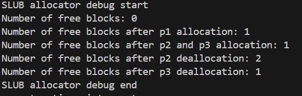

# Challenge 1: Buddy System 分配算法分析

# Buddy System 分配算法分析

## 1. 概述

Buddy System（伙伴系统）算法将可用存储空间划分为存储块（Block）来管理，每个存储块大小必须是 2 的 n 次幂（例如：1、2、4、8、16、32、64、128 等）。这种算法的本质是一种**“分离适配”**，即按 2 的幂次划分内存，使其适配最佳匹配大小。其优点是快速搜索与合并（O(log N) 时间复杂度），以及较低的外部碎片；但缺点是内部碎片，因为按 2 的幂划分，当需求大小不符合块大小时会造成浪费。

## 2. 内存分配过程

分配内存的过程如下：

1. 寻找一个大小大于等于所需大小且最接近的 2 的幂次内存块。
2. 如果找到了相应大小的块，则分配给应用程序。
3. 若没有找到合适的块，则对高于需求大小的空闲块进行对半拆分，直到找到合适的块。
4. 重复上述过程，直至得到符合条件的内存块。

## 3. 内存释放过程

释放内存时，释放指定的内存块后检查相邻的块：

1. 若相邻块已释放且大小相同，合并这两个块。
2. 重复上述步骤直到相邻块未释放或达到最高限（即所有内存已释放）。

## 4. 实现思路

Buddy System 使用一个数组形式的完全二叉树监控内存管理。二叉树节点标记相应内存块的使用状态，层级越高表示内存块越大，层级越低表示内存块越小。在分配和释放过程中，利用这些节点的标记进行块的分离与合并。

假设总内存大小为 16 个单位，建立深度为 5 的满二叉树，以根节点开始监控大小为 16 的块，其左右子节点监控大小为 8 的块，依此类推。

## 5. 代码实现

### 初始化内存（`buddy_init_memmap`）

```c
static void buddy_init_memmap(struct Page *base, size_t n) {
    int i = 0;
    assert(n > 0);
    
    max_pages = 1;
    for (i = 1; i < BUDDY_MAX_DEPTH; ++i, max_pages <<= 1)
        if (max_pages + (max_pages >> 9) >= n)
            break;

    max_pages >>= 1;
    buddy_page_num = (max_pages >> 9) + 1;

    cprintf("buddy init: total %d, use %d, free %d\n", n, buddy_page_num, max_pages);

    for (i = 0; i < buddy_page_num; ++i)
        SetPageReserved(base + i);

    buddy_allocatable_base = base + buddy_page_num;

    struct Page* p;
    for (p = buddy_allocatable_base; p != base + n; ++p) {
        ClearPageReserved(p);
        SetPageProperty(p);
        set_page_ref(p, 0);
    }

    buddy_page = (unsigned int*)KADDR(page2pa(base));

    for (i = max_pages; i < max_pages << 1; ++i)
        buddy_page[i] = 1;

    for (i = max_pages - 1; i > 0; --i)
        buddy_page[i] = buddy_page[i << 1] << 1;
}
```

### 分配页面（`buddy_alloc_pages`）

```c
static struct Page* buddy_alloc_pages(size_t n) {
    assert(n > 0);
    if (n > buddy_page[1]) return NULL;

    unsigned int index = 1, size = max_pages;
    for (; size >= n; size >>= 1) {
        if (buddy_page[index << 1] >= n) index <<= 1;
        else if (buddy_page[index << 1 | 1] >= n) index = index << 1 | 1;
        else break;
    }

    buddy_page[index] = 0;
    struct Page* new_page = buddy_allocatable_base + index * size - max_pages;

    struct Page* p;
    for (p = new_page; p != new_page + size; ++p)
        set_page_ref(p, 0), ClearPageProperty(p);

    for (; (index >>= 1) > 0; )
        buddy_page[index] = max(buddy_page[index << 1], buddy_page[index << 1 | 1]);

    return new_page;
}
```

### 释放页面（`buddy_free_pages`）

```c
static void buddy_free_pages(struct Page *base, size_t n) {
    assert(n > 0);

    unsigned int index = (unsigned int)(base - buddy_allocatable_base) + max_pages, size = 1;

    for (; buddy_page[index] > 0; index >>= 1, size <<= 1);

    struct Page* p;
    for (p = base; p != base + n; ++p) {
        assert(!PageReserved(p) && !PageProperty(p));
        SetPageProperty(p), set_page_ref(p, 0);
    }

    for (buddy_page[index] = size; size <<= 1, (index >>= 1) > 0;)
        buddy_page[index] = (buddy_page[index << 1] + buddy_page[index << 1 | 1] == size) ? size : max(buddy_page[index << 1], buddy_page[index << 1 | 1]);
}
```

## 6. 运行结果


# Challenge 2: SLUB 分配器实现分析

# SLUB 分配器实现分析

该代码实现了一个简单的内存分配系统，使用 SLUB（Simple List of Unused Blocks）分配器来管理小块和大块内存的分配和释放。通过维护空闲列表，分配器有效地分配内存，适用于频繁的小块内存分配场景。以下是该实现的结构与方法逐步解析。

## 1. 基本数据结构

### 小块内存块 (`mem_block`)
这是一个空闲块链表中的节点结构，每个小块内存块包含：
- `size_units`：块的大小，以 `BLOCK_UNIT` 为单位（即 `mem_block_t` 的大小）。
- `next`：指向下一个内存块的指针。

### 大块内存块 (`large_block`)
表示一个大于一页的大块内存的结构体。
- `order`：表示页数的次方（例如，`order = 2` 表示 4 页）。
- `pages`：指向分配的大块内存的指针。
- `next`：指向下一个大块的指针。

## 2. 初始化与空闲列表

```c
static mem_block_t base_arena = { .next = &base_arena, .size_units = 1 };
static mem_block_t *free_list = &base_arena;
static large_block_t *large_blocks = NULL;
```

- `base_arena` 是初始的空闲块，自引用形成一个循环，表示空闲列表的头部。
- `free_list` 是遍历和管理所有小块内存的指针。
- `large_blocks` 是管理大块内存的链表。

## 3. 小块内存分配 (`allocate_small_block`)

```c
static void *allocate_small_block(size_t size) {
    assert(size < PGSIZE);  // 确保分配小于页面大小
    ...
}
```

- 此函数用于分配小于一页的小块内存。
- 使用 `BLOCK_UNITS(size)` 计算所需块的数量。
- 遍历 `free_list` 寻找合适大小的块：
  - 如果找到完全符合的块，则从列表中移除并返回。
  - 如果找到的块比需求大，则拆分块，将剩余部分保留在空闲列表中。
- 若未找到合适大小的块，通过 `alloc_pages(1)` 分配一页新内存，将其加入空闲列表并重新尝试分配。

## 4. 小块内存释放 (`free_small_block`)

```c
static void free_small_block(void *block, int size) {
    if (!block) return;
    ...
}
```

- `free_small_block` 用于释放指定大小的小块内存，将块按地址顺序插入 `free_list`。
- 检查是否可以合并相邻的内存块：
  - 若当前块与前后空闲列表中的块相邻，则合并成一个更大的块以减少碎片。

## 5. 大块内存分配 (`slub_allocate`)

```c
void *slub_allocate(size_t size) {
    ...
    if (size < PGSIZE - BLOCK_UNIT) {  // 如果请求小于一页
        ...
    }
    ...
}
```

- `slub_allocate` 是通用分配接口，基于请求大小选择小块或大块分配。
- 当请求小于一页时，调用 `allocate_small_block`。
- 对于更大的请求，分配 `large_block_t` 描述符并使用 `alloc_pages` 分配实际物理内存页面。
- 分配成功后，将 `large_block` 插入 `large_blocks` 链表进行跟踪。

## 6. 大块内存释放 (`slub_release`)

```c
void slub_release(void *block) {
    if (!block) return;
    ...
}
```

- `slub_release` 检查给定指针是否属于大块或小块。
- 对于大块，遍历 `large_blocks`，找到并释放对应的内存页和描述符。
- 小块则使用 `free_small_block` 处理释放。

## 7. 调试函数 (`slub_debug`)

```c
void slub_debug() {
    ...
    void *p1 = slub_allocate(4096);
    ...
}
```

- `slub_debug` 用于测试和输出分配器的状态，显示分配和释放后的 `free_list` 变化，验证分配器的正确性。
- 


## 总结

该实现使用链表结构作为空闲列表，适合频繁的小块内存分配需求。对于大块内存，通过页面分配和 `large_block_t` 链表管理，支持多种内存需求场景。


# Challenge 3: 操作系统内存检测方法

# 操作系统内存检测方法

操作系统可以通过多种方式检测和管理物理内存。以下是几种常见的内存检测方法：

## 1. BIOS/UEFI 内存检测

操作系统可以通过与 BIOS（基本输入输出系统）或 UEFI（统一可扩展固件接口）进行交互，获取可用内存的信息。BIOS 或 UEFI 在系统启动时进行内存检测，并通过一个称为 `e820` 的接口提供内存的详细布局。操作系统可以通过 `e820` 调用来获取系统内存布局，包括哪些内存区域是可用的、哪些是保留的或专供其他设备使用的。

## 2. ACPI 表

ACPI（高级配置和电源接口）提供一些描述系统内存布局的表格，例如 SRAT（系统资源关联表）。操作系统可以读取这些 ACPI 表来确定物理内存的布局和可用性。

## 3. 固件接口

操作系统还可以直接与系统固件通信，以查询可用物理内存。UEFI 提供了一些 API，比如通过 `GetMemoryMap()` 函数，操作系统可以查询系统的内存状态，包括内存块的地址和类型。

## 4. 自检内存探测

操作系统可以自行检测物理内存的可用性。此过程可以通过在某些内存区域逐段写入和读取来完成，以验证这些内存是否能正常工作。但这种方式效率较低，可能会对部分硬件造成影响，因此通常不采用。

## 5. 引导加载程序（Bootloader）提供的信息

现代操作系统通常依赖引导加载程序（如 GRUB）来传递系统硬件信息。引导加载程序在启动时与 BIOS 或 UEFI 交互，检测内存布局，并将可用物理内存范围等信息传递给内核。内核在启动后可以利用这些信息来了解可用内存的布局。

